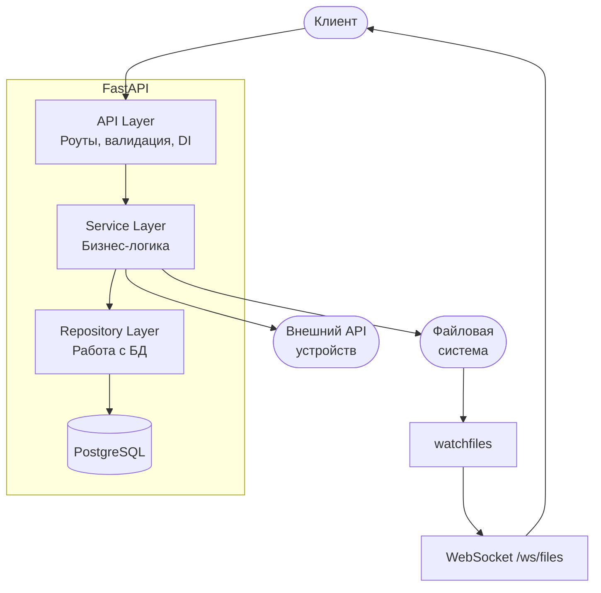
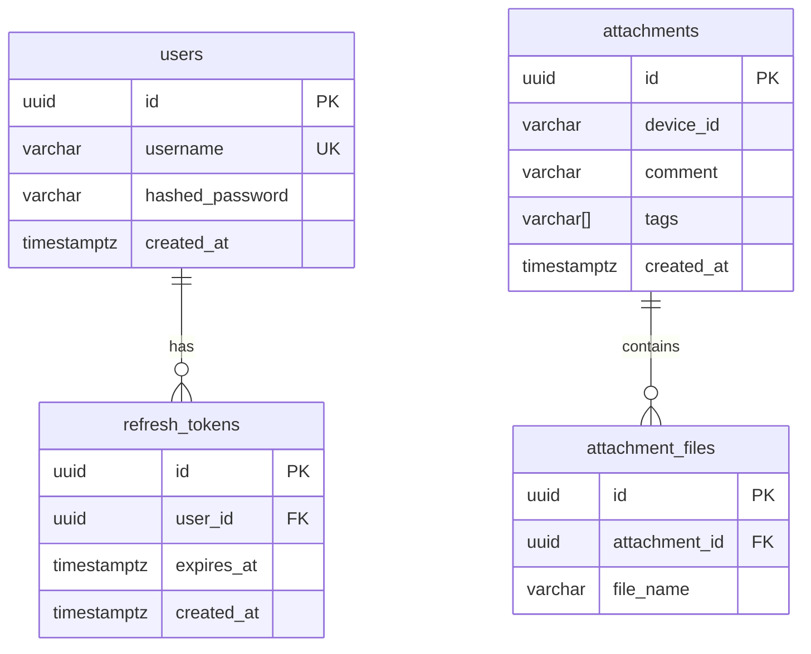

# FiFoD - Files For Device

Сервис для привязки файлов к устройствам. Получает список устройств из внешнего REST API, работает с файлами в локальной директории и хранит привязки в PostgreSQL.

**Что умеет:**
- JWT-авторизация с refresh-токенами и ротацией
- Проксирование списка свободных устройств из внешнего API (с retry и кэшированием)
- Управление файлами через локальную директорию с отслеживанием изменений через WebSocket
- Привязка файлов к устройствам с валидацией
- Rate limiting на критичных эндпоинтах
- Healthcheck с проверкой подключения к БД

## Быстрый старт

```bash
cp .env.example .env
docker compose up --build
```

Сервис поднимется на `http://localhost:8000`. Миграции применяются автоматически при старте контейнера.

Swagger UI доступен по адресу `/docs` - поддерживает кнопку **Authorize** для тестирования с JWT.

В dev-режиме (с `docker-compose.override.yml`) код монтируется в контейнер и uvicorn перезапускается при изменениях.

## Архитектура

Проект построен на слоёной архитектуре - каждый слой знает только о слое ниже:



Зависимости инжектируются через FastAPI `Depends` - это позволяет легко подменять их в тестах.

### Схема базы данных



Фоновая задача каждый час удаляет просроченные refresh-токены.

## API

### Авторизация

Все эндпоинты (кроме `/api/auth/*` и `/health`) защищены JWT.

**POST /api/auth/register** - регистрация

```bash
curl -X POST http://localhost:8000/api/auth/register \
  -H "Content-Type: application/json" \
  -d '{"username": "admin", "password": "secret123"}'
```

```json
{
  "id": "550e8400-e29b-41d4-a716-446655440000",
  "username": "admin",
  "created_at": "2025-01-15T12:00:00Z"
}
```

**POST /api/auth/login** - получение токенов

```bash
curl -X POST http://localhost:8000/api/auth/login \
  -d "username=admin&password=secret123"
```

```json
{
  "access_token": "eyJhbGciOiJIUzI1NiIs...",
  "refresh_token": "550e8400-e29b-41d4-a716-446655440000",
  "token_type": "bearer"
}
```

Access-токен живёт 30 минут, refresh - 7 дней.

**POST /api/auth/refresh** - обновление пары токенов

```bash
curl -X POST http://localhost:8000/api/auth/refresh \
  -H "Content-Type: application/json" \
  -d '{"refresh_token": "<refresh_token>"}'
```

Каждый refresh-токен одноразовый - после использования выдаётся новая пара (ротация).

### Устройства

**GET /api/devices** - список свободных устройств

```bash
curl http://localhost:8000/api/devices \
  -H "Authorization: Bearer <access_token>"
```

```json
[
  {
    "serial": "ABC123",
    "model": "Pixel 7",
    "version": "14.0",
    "notes": ""
  }
]
```

Проксирует данные из внешнего API, фильтруя только свободные устройства (`ready=true`, `using=false`). При 5xx или `success=false` повторяет запрос (настраивается через env). Результат кэшируется на 30 секунд.

### Файлы

**GET /api/files** - список файлов в рабочей директории

```bash
curl "http://localhost:8000/api/files?skip=0&limit=10" \
  -H "Authorization: Bearer <access_token>"
```

```json
[
  {
    "name": "firmware.bin",
    "size": 1048576,
    "modified_at": "2025-01-15T12:00:00Z"
  }
]
```

Файлы добавляются через volume:
```bash
cp firmware.bin ./files/
```

Результат кэшируется на 60 секунд. Кэш сбрасывается автоматически при изменениях в директории.

### Привязки

**POST /api/attachments** - создать привязку файлов к устройству

```bash
curl -X POST http://localhost:8000/api/attachments \
  -H "Authorization: Bearer <access_token>" \
  -H "Content-Type: application/json" \
  -d '{"deviceId": "ABC123", "fileNames": ["firmware.bin", "config.json"]}'
```

```json
{
  "id": "550e8400-e29b-41d4-a716-446655440000",
  "device_id": "ABC123",
  "comment": null,
  "tags": [],
  "created_at": "2025-01-15T12:00:00Z",
  "files": [
    {"id": "...", "file_name": "firmware.bin"},
    {"id": "...", "file_name": "config.json"}
  ]
}
```

Перед сохранением проверяется доступность устройства и наличие всех файлов (проверки выполняются параллельно через `asyncio.gather`).

**GET /api/attachments** - список привязок

Поддерживает пагинацию (`skip`, `limit`) и фильтрацию по тегам (`?tag=test&tag=prod`).

### Healthcheck

**GET /health** - состояние сервиса

```json
{"status": "ok", "database": "available"}
```

Проверяет подключение к БД через `SELECT 1`.

### WebSocket

**WS /ws/files** - события изменения файлов в реальном времени

```json
{"event": "file_added", "name": "firmware.bin"}
{"event": "file_modified", "name": "config.json"}
{"event": "file_deleted", "name": "old_file.bin"}
```

Тестовая страница доступна по адресу `/ws-test`.

## Конфигурация

Полный список переменных - в `.env.example`.

### База данных

| Переменная | По умолчанию | Описание |
|---|---|---|
| `DATABASE_URL` | - | Строка подключения (`postgresql+asyncpg://...`) |
| `DB_POOL_SIZE` | `10` | Постоянные соединения в пуле |
| `DB_MAX_OVERFLOW` | `20` | Дополнительные соединения сверх пула |
| `DB_POOL_RECYCLE` | `3600` | Пересоздание соединений (сек) |

### JWT

| Переменная | По умолчанию | Описание |
|---|---|---|
| `JWT_SECRET_KEY` | - | Секретный ключ подписи |
| `JWT_ALGORITHM` | `HS256` | Алгоритм подписи |
| `JWT_ACCESS_TOKEN_EXPIRE_MINUTES` | `30` | Время жизни access-токена |
| `JWT_REFRESH_TOKEN_EXPIRE_DAYS` | `7` | Время жизни refresh-токена |

### Внешний API

| Переменная | По умолчанию | Описание |
|---|---|---|
| `EXTERNAL_API_URL` | - | URL API устройств |
| `EXTERNAL_API_TOKEN` | - | Bearer-токен |
| `EXTERNAL_API_RETRY_COUNT` | `3` | Количество повторных попыток |
| `EXTERNAL_API_RETRY_DELAY` | `1.0` | Пауза между попытками (сек) |

### HTTP-клиент

| Переменная | По умолчанию | Описание |
|---|---|---|
| `HTTP_TIMEOUT_CONNECT` | `5.0` | Таймаут соединения (сек) |
| `HTTP_TIMEOUT_READ` | `10.0` | Таймаут ответа (сек) |
| `HTTP_TIMEOUT_WRITE` | `10.0` | Таймаут отправки (сек) |
| `HTTP_TIMEOUT_POOL` | `5.0` | Таймаут пула (сек) |
| `HTTP_MAX_CONNECTIONS` | `100` | Максимум соединений |
| `HTTP_MAX_KEEPALIVE_CONNECTIONS` | `20` | Максимум keep-alive |
| `HTTP_KEEPALIVE_EXPIRY` | `30.0` | Время жизни keep-alive (сек) |

### Прочее

| Переменная | По умолчанию | Описание |
|---|---|---|
| `FILE_DIR` | `/app/files` | Директория с файлами |
| `CACHE_FILES_TTL` | `60` | TTL кэша файлов (сек) |
| `CACHE_DEVICES_TTL` | `30` | TTL кэша устройств (сек) |
| `LOG_LEVEL` | `INFO` | Уровень логирования |

Для Docker Compose также нужны `POSTGRES_USER`, `POSTGRES_PASSWORD`, `POSTGRES_DB`.

## Тестирование

```bash
pip install -r requirements.txt
pytest
```

Тесты используют SQLite in-memory (aiosqlite) и не требуют запущенного PostgreSQL.

**Что покрыто (25 тестов):**

- **Авторизация** - регистрация, дубликаты, валидация, логин, неверный пароль, refresh-ротация, повторное использование refresh-токена, невалидный токен, декодирование JWT
- **Файлы** - листинг, пагинация, пустая/несуществующая директория, проверка существования, защита от path traversal
- **Устройства** - фильтрация, пустой список, кэширование, ошибки 4xx, retry при 5xx
- **Healthcheck** - проверка /health

## Структура проекта

```
app/
  api/              Роуты и обработчики ошибок
  services/         Бизнес-логика
  repositories/     Работа с БД
  db/               ORM-модели, сессии
  schemas/          Pydantic-схемы
  infrastructure/   Движок БД, HTTP-клиент, кэш, lifespan
  core/             Логирование, rate limiter
  main.py           Точка входа
  router.py         Подключение роутеров
  dependencies.py   Фабрики зависимостей (Depends)
  config.py         Настройки (pydantic-settings)
  exceptions.py     Доменные исключения
migrations/         Alembic-миграции
tests/              Тесты (pytest + pytest-asyncio)
files/              Директория для файлов (volume)
```

## Стек

- **Python 3.12, FastAPI, uvicorn** - async из коробки, автогенерация OpenAPI-документации
- **PostgreSQL 16, SQLAlchemy 2.0 (async), Alembic** - типизированный ORM с миграциями
- **PyJWT + passlib/bcrypt** - JWT-авторизация с ротацией refresh-токенов
- **httpx** - async HTTP-клиент для работы с внешним API
- **watchfiles** - отслеживание изменений файлов, WebSocket-уведомления
- **slowapi** - rate limiting на основе slowapi/limits
- **pytest + pytest-asyncio + aiosqlite** - тестирование с in-memory SQLite
- **Docker, Docker Compose** - контейнеризация и оркестрация
